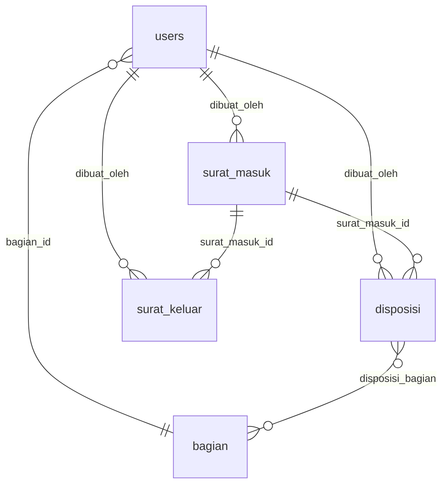

# Database ERD — SiSurat

## Diagram Relasi (dbdiagram.io)

> [!NOTE]
> ERD visual tersedia di file `erd-diagram.png` di folder yang sama.
> Sumber: [dbdiagram.io](https://dbdiagram.io)

```
┌──────────────┐         ┌──────────────┐
│    users     │────────>│    bagian     │
│              │         │              │
│ id           │         │ id           │
│ bagian_id FK │─────────│ nama_bagian  │
│ name         │         │ kode_bagian  │
│ email        │         └──────────────┘
│ password     │                │
│ is_active    │                │
└──────┬───────┘                │
       │                       │
       │ dibuat_oleh            │ bagian_id
       │                       │
┌──────┴───────┐     ┌─────────┴────┐     ┌──────────────┐
│ surat_masuk  │────>│  disposisi   │────>│  disposisi_  │
│              │     │              │     │  bagian      │
│ id           │     │ id           │     │              │
│ nomor_agenda │     │ surat_masuk_ │     │ disposisi_id │
│ nomor_surat  │     │   id FK      │     │ bagian_id    │
│ perihal      │     │ dibuat_oleh  │     └──────────────┘
│ status       │     │   FK         │
│ file_path    │     │ instruksi    │
│ dibuat_oleh  │     │ catatan      │
│   FK         │     └──────────────┘
│ catatan_warek│
│ catatan_rektr│     ┌──────────────┐     ┌──────────────┐
└──────┬───────┘     │ nomor_surat_ │     │ surat_keluar │
       │             │ counter      │     │              │
       │             │              │     │ id           │
       └────────────>│ id           │     │ nomor_surat  │
                     │ tahun        │     │ nomor_urut   │
                     │ kode_unit    │     │ perihal      │
                     │ last_number  │     │ tujuan_surat │
                     └──────────────┘     │ status       │
                                          │ dibuat_oleh  │
                                          │   FK         │
                                          │ surat_masuk_ │
                                          │   id FK      │
                                          └──────────────┘
```

---

## Tabel: `users`

Tabel bawaan Laravel + kolom tambahan.

| Kolom | Tipe | Constraint | Keterangan |
|-------|------|-----------|-----------|
| id | bigint unsigned | PK, AI | - |
| bagian_id | bigint unsigned | NULLABLE, FK → bagian.id | Bagian tempat user bekerja |
| name | varchar(255) | NOT NULL | Nama lengkap |
| email | varchar(255) | NOT NULL, UNIQUE | Email login |
| password | varchar(255) | NOT NULL | Bcrypt hash |
| is_active | tinyint(1) | NOT NULL | Akun aktif/nonaktif |
| email_verified_at | timestamp | NULLABLE | Bawaan Laravel |
| remember_token | varchar(100) | NULLABLE | Bawaan Laravel |
| created_at | timestamp | - | - |
| updated_at | timestamp | - | - |

**Relasi:**
- `belongsTo` → Bagian (melalui `bagian_id`)
- Role via Spatie: `model_has_roles` (tabel pivot Spatie)

---

## Tabel: `bagian`

Master data unit/bagian di universitas.

| Kolom | Tipe | Constraint | Keterangan |
|-------|------|-----------|-----------|
| id | bigint unsigned | PK, AI | - |
| nama_bagian | varchar(150) | NOT NULL | Contoh: "Biro Akademik" |
| kode_bagian | varchar(20) | NOT NULL, UNIQUE | Contoh: "BAK" |
| created_at | timestamp | - | - |
| updated_at | timestamp | - | - |

**Data awal (seeder):**
- BAK — Biro Akademik
- SDM — Biro Sumber Daya Manusia
- KEU — Biro Keuangan
- UMUM — Biro Umum

---

## Tabel: `surat_masuk`

Tabel utama MVP.

| Kolom | Tipe | Constraint | Keterangan |
|-------|------|-----------|-----------|
| id | bigint unsigned | PK, AI | - |
| nomor_agenda | varchar(30) | NOT NULL | Nomor urut internal |
| nomor_surat | varchar(100) | NOT NULL | Nomor di surat fisik |
| tanggal_surat | date | NOT NULL | Tanggal di surat |
| tanggal_diterima | date | NOT NULL | Tanggal diterima kampus |
| asal_surat | varchar(255) | NOT NULL | Pengirim/instansi asal |
| perihal | varchar(500) | NOT NULL | Perihal surat |
| jenis_surat | varchar(100) | NOT NULL | Undangan/SK/Permohonan/dll |
| tingkat_urgensi | varchar(20) | NOT NULL | normal, segera, sangat_segera |
| is_rahasia | tinyint(1) | NOT NULL | Surat rahasia/biasa |
| file_path | varchar(500) | NULLABLE | Path file di storage |
| status | varchar(30) | NOT NULL | Lihat enum di bawah |
| dibuat_oleh | bigint unsigned | FK → users.id, NOT NULL | Admin yang input |
| catatan_warek | text | NULLABLE | Catatan dari Wakil Rektor |
| catatan_rektor | text | NULLABLE | Catatan dari Rektor |
| created_at | timestamp | - | - |
| updated_at | timestamp | - | - |

**Enum `status`:**
- `draft` — baru diinput Admin
- `menunggu_warek` — sudah diajukan ke Wakil Rektor
- `menunggu_rektor` — sudah diteruskan Warek ke Rektor
- `selesai` — diapprove Rektor
- `dikembalikan` — dikembalikan oleh Warek atau Rektor

**Enum `tingkat_urgensi`:**
- `normal`
- `segera`
- `sangat_segera`

**Relasi:**
- `belongsTo` → User (melalui `dibuat_oleh`)
- `hasMany` → Disposisi
- `hasMany` → SuratKeluar (melalui `surat_masuk_id`)

---

## Tabel: `disposisi` (Sprint 3)

| Kolom | Tipe | Constraint | Keterangan |
|-------|------|-----------|-----------|
| id | bigint unsigned | PK, AI | - |
| surat_masuk_id | bigint unsigned | FK → surat_masuk.id, NOT NULL | - |
| dibuat_oleh | bigint unsigned | FK → users.id, NOT NULL | Rektor yang buat disposisi |
| instruksi | text | NOT NULL | Instruksi dari Rektor |
| catatan | text | NULLABLE | Catatan tambahan |
| created_at | timestamp | - | - |
| updated_at | timestamp | - | - |

**Relasi:**
- `belongsTo` → SuratMasuk
- `belongsTo` → User (dibuat_oleh)
- `belongsToMany` → Bagian (melalui `disposisi_bagian`)

---

## Tabel: `disposisi_bagian` (Pivot, Sprint 3)

| Kolom | Tipe | Constraint |
|-------|------|-----------|
| disposisi_id | bigint unsigned | FK → disposisi.id |
| bagian_id | bigint unsigned | FK → bagian.id |

> [!NOTE]
> Tabel pivot ini **tidak memiliki kolom `id`** dan **tidak memiliki `timestamps`** sesuai ERD.

---

## Tabel: `nomor_surat_counter`

Counter otomatis untuk penomoran surat keluar per tahun per unit.

| Kolom | Tipe | Constraint | Keterangan |
|-------|------|-----------|-----------|
| id | bigint unsigned | PK, AI | - |
| tahun | year | NOT NULL | Tahun counter aktif |
| kode_unit | varchar(30) | NOT NULL | Kode bagian/unit |
| last_number | int | NOT NULL | Nomor terakhir yang terpakai |
| created_at | timestamp | - | - |
| updated_at | timestamp | - | - |

> [!TIP]
> Kombinasi `tahun` + `kode_unit` sebaiknya dibuat UNIQUE INDEX untuk menghindari duplikasi counter.

---

## Tabel: `surat_keluar`

Tabel untuk surat keluar.

| Kolom | Tipe | Constraint | Keterangan |
|-------|------|-----------|-----------|
| id | bigint unsigned | PK, AI | - |
| nomor_surat | varchar(100) | NOT NULL | Nomor surat keluar (auto-generated) |
| nomor_urut | int | NOT NULL | Nomor urut dalam tahun |
| perihal | varchar(500) | NOT NULL | Perihal surat keluar |
| tujuan_surat | varchar(255) | NOT NULL | Tujuan/penerima surat |
| tanggal_surat | date | NOT NULL | Tanggal surat |
| isi_ringkas | text | NULLABLE | Ringkasan isi surat |
| jenis_surat | varchar(100) | NOT NULL | Jenis surat keluar |
| file_draft_path | varchar(500) | NULLABLE | Path file draft |
| file_final_path | varchar(500) | NULLABLE | Path file final (setelah disetujui) |
| status | varchar(30) | NOT NULL | Status approval surat keluar |
| dibuat_oleh | bigint unsigned | FK → users.id, NOT NULL | Admin/user yang membuat |
| catatan_admin | text | NULLABLE | Catatan dari Admin |
| catatan_warek | text | NULLABLE | Catatan dari Wakil Rektor |
| catatan_rektor | text | NULLABLE | Catatan dari Rektor |
| surat_masuk_id | bigint unsigned | FK → surat_masuk.id, NULLABLE | Referensi surat masuk (jika balasan) |
| created_at | timestamp | - | - |
| updated_at | timestamp | - | - |

**Relasi:**
- `belongsTo` → User (melalui `dibuat_oleh`)
- `belongsTo` → SuratMasuk (melalui `surat_masuk_id`, NULLABLE — surat keluar bisa mandiri atau sebagai balasan)

---

## Tabel Spatie Permission (Otomatis)

Dibuat otomatis saat `php artisan vendor:publish` Spatie:
- `roles` — daftar role
- `permissions` — daftar permission
- `model_has_roles` — pivot user ↔ role
- `model_has_permissions` — pivot user ↔ permission
- `role_has_permissions` — pivot role ↔ permission

---

## Ringkasan Relasi Antar Tabel


